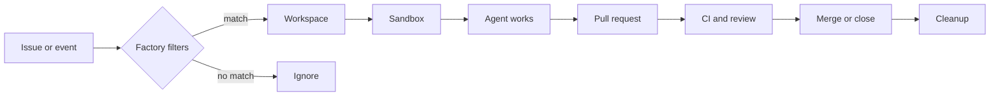

# ElasticClaw

[](LICENSE)
[](https://elasticclaw.ai/docs)

**Open source workflow automation for coding agents.**

ElasticClaw turns issue tracker events into governed coding workflows: start the right agent, provision an isolated workspace, inject the issue context, mint scoped GitHub credentials, open the PR, watch review and CI, and clean everything up when the work is done.

Remote coding agents give you a shell. ElasticClaw gives you the workflow around it.

<p align="center">
  <a href="https://www.youtube.com/watch?v=2h_-3HsV9Bo">
    
  </a>
</p>

## Why ElasticClaw exists

AI coding agents are getting good enough to do real work, but real work does not begin with a prompt and end with a terminal transcript. It starts in Linear, GitHub Issues, Shortcut, webhooks, releases, customer escalations, dependency alerts, and private operational queues. It needs credentials with boundaries. It needs branch and PR policy. It needs logs, lifecycle state, review handling, CI awareness, and cleanup.

ElasticClaw is the control plane for that loop.

Instead of manually launching agents one at a time, you define **workspaces** and **workflows**: repeatable workstreams that know when to start, what access to grant, which model and tools are allowed, how to drive the PR, and when to tear the sandbox down.

## What it does

- **Workspaces** define the runtime: repos, bootstrap files, instructions, environment, MCP servers, model defaults, and provider settings.
- **Workflows** define the automation: trigger rules, stages, issue movement, lifecycle policy, and cleanup.
- **Scoped GitHub App credentials** give each agent temporary repo access instead of broad personal tokens.
- **Issue tracker integrations** turn Linear, GitHub Issues, Shortcut, and webhook events into structured work.
- **Sandbox providers** run each agent in an isolated workspace using Daytona, Replicated CMX, or exe.dev.
- **Single-binary ElasticClaw Server** gives you the API, web UI, state, settings, and workflow automation in one self-hosted Go service.

Each running agent runs [OpenClaw](https://github.com/openclaw/openclaw), connects back to ElasticClaw Server through the connector, clones the allowed repos, receives the issue context, and works inside an ephemeral VM.

## The Workflow Loop



ElasticClaw is designed for the work that should happen again and again:

- Bug lanes from Linear statuses
- Dependency update workflows
- Docs and migration queues
- Release follow-up tasks
- Customer escalation workflows
- Background work that should produce PRs, not meetings

## Quick start

Install the CLI:

```bash
brew tap elasticclaw/elasticclaw
brew install elasticclaw
```

Deploy ElasticClaw Server to an Ubuntu VPS:

```bash
elasticclaw install \
  --server ssh://root@my-server.com \
  --domain server.mycompany.com \
  --ssh-key ~/.ssh/id_ed25519
```

Then configure the pieces your first workflow needs:

1. A sandbox provider such as Daytona, Replicated CMX, or exe.dev.
2. A GitHub App so ElasticClaw can mint scoped installation tokens.
3. A workspace that defines repos, instructions, tools, and model defaults.
4. An issue source such as Linear, GitHub Issues, Shortcut, or a webhook.
5. A workflow that ties the trigger, workspace access, and lifecycle together.

Watch the installation walkthrough: [YouTube quick start](https://www.youtube.com/watch?v=1joBaUrtwOA).

Full setup guide: [elasticclaw.ai/docs/installation](https://elasticclaw.ai/docs/installation)

### Linear workflow triggers

`trigger.linear` supports `event`, `workspace`, `team`, `projects`, `states`, `labels`, `exclude_labels`, `assigned_to`, and `agent_status_error`. When `projects` is omitted or empty, issues in any Linear project—including issues with no project—can match. Otherwise, an issue must belong to one of the listed project IDs or names.

```yaml
trigger:
  linear:
    event: status_changed
    team: ADV
    projects:
      - Adversary Labs
    states:
      - Todo
```

See the [Linear issue workflow example](examples/workflows/linear-issue.yaml).

### Repository environment preflight

Before delivering the entry-stage prompt to an agent, workflow claws scan
checked-out repositories for common runtime declarations such as
`pyproject.toml`, `package.json`, `go.mod`, and `rust-toolchain.toml`. The scan
also checks executables referenced by workflow `run` commands and writes its
findings to `REPO_ENVIRONMENT.md`. It reads manifests but does not execute
repository setup scripts or install dependencies.

Preflight warnings are enabled by default. Use `required` to stop an
incompatible workflow before model work begins, or `off` to disable the scan:

```yaml
environment:
  preflight: required

stages:
  - id: test
    on_enter:
      run:
        command: cd my-repo && .venv/bin/python -m pytest -q
```

## Three ways to start work

**From an issue tracker**

Move a ticket to a trigger status, apply a label, assign it, or let your normal process send the event. The workflow filters the event and starts an agent with the issue body, links, labels, repos, and instructions.

**From the web UI**

Create and inspect agents, manage workspaces and workflows, configure providers, review logs, and connect issue trackers from the embedded dashboard.

**From your own automation**

Use webhooks and the ElasticClaw Server API to connect private queues, release events, internal systems, or scheduled work.

## Architecture

ElasticClaw has four main moving parts:

- **ElasticClaw Server**: the self-hosted control point for settings, secrets, workspaces, workflows, lifecycle state, and the web UI.
- **Provider**: the execution backend that creates isolated workspaces.
- **Bridge**: the connector running inside the workspace that links OpenClaw to ElasticClaw Server.
- **Agent**: the sandboxed coding session doing the actual work.

ElasticClaw Server owns policy. Providers own compute. OpenClaw owns the coding session. ElasticClaw connects them into a repeatable issue-to-PR workflow.

## Documentation

This fork adds a Windows desktop application. Its documentation lives in the repo,
because it covers behaviour specific to this fork:

- [Windows desktop app](docs/DESKTOP_APP.md) — install, file locations, providers,
  browser previews, and how a run progresses stage by stage
- [Troubleshooting](docs/TROUBLESHOOTING.md) — diagnosed failures with their real
  symptoms; start here when a run stalls, a PR is not watched, or a preview never appears

Upstream documentation:

- [Overview](https://elasticclaw.ai/docs)
- [Installation](https://elasticclaw.ai/docs/installation)
- [Workspaces](https://elasticclaw.ai/docs/workspaces)
- [Workflows](https://elasticclaw.ai/docs/workflows)
- [Providers](https://elasticclaw.ai/docs/providers)
- [GitHub integration](https://elasticclaw.ai/docs/github-integration)
- [Linear integration](https://elasticclaw.ai/docs/linear-integration)
- [CLI reference](https://elasticclaw.ai/docs/cli-reference)

## Project status

ElasticClaw is early, open source, and moving quickly. The core loop is usable today: deploy ElasticClaw Server, connect a provider, configure GitHub and an issue tracker, and run agents from real work queues.

The vision is broader: software workflows that are owned by teams, wired into existing systems, and governed by explicit stages instead of ad hoc prompts.

## Contributing

See [CONTRIBUTING.md](CONTRIBUTING.md) for development setup and workflow.

If ElasticClaw looks useful, stars and public feedback help other developers find the project. Try it, break it, post what was confusing, and show what you built.

## License

[Apache 2.0](LICENSE)
